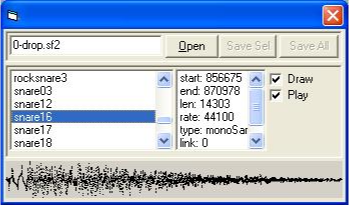
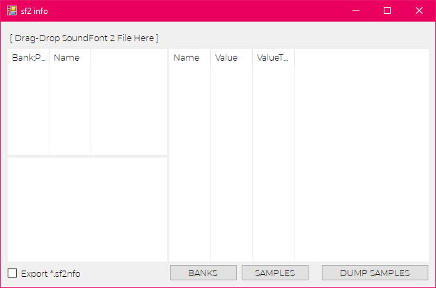
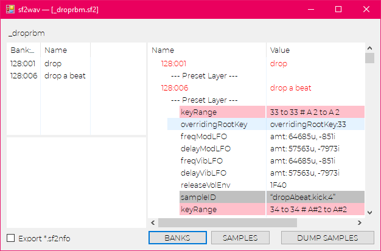
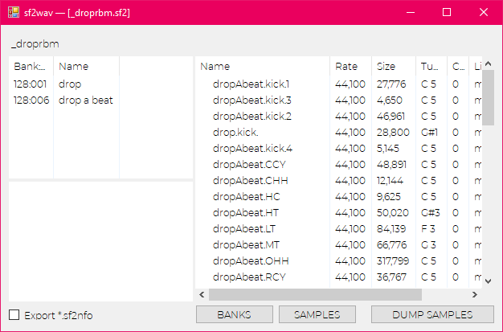

Microsoft Visual Studio Community and/or applicable Build Tools  

Requires DotNet Framework in order to run on the system  
Target DotNet Framework = v4.0


CONCEPT
============

better subtitled: "LACK THEREOF CONCEPT"

Once upon a time I wrote a sample dumper browser I think maybe in VB somewhere around 2000-03, IDK.  This was a little utility made from a larger project at the time…

  
^ NOT WHAT THIS IS ^

----

Generally I wanted to do the same in csharp so I could abstract windowing the wave-form data but never got around to it.

utility is in listing preset data as stred in the file and also it lists samples.  
additionally there is a check-box to enable dumping file-info as well.

DO NOT USE THIS ON LARGE COMPLEX FILES

if you don't know what a large program or file is anything that has GM-Bank in the title is kind of clue but I'd say just CTRL+ALT+DEL and END-TASK if you're annoyed.  is what is.

since it just isn't designed to handle such complexity and it would take quite a quite while to loop through all the preset info.  Some soundfonts can have lots more data in them and minimal samples its strange.

also it can dump all the wave-forms to Microsoft r-iff wave format.  

OPERATIONS
===================

when you load the program you need to drag-drop a sound-font (*.sf2) into its little drag-here caption.



when a file is loaded it loads all the preset data in the file—so if loading a complex huge general-midi kind of file, your probably going to be waiting a while as well if you export anything.  

**Preset List View** (click "PRESETS" button or when soundfont is loaded)  
  

**Sample List View** (click "SAMPLES" button)


So generally if you click dump samples, the samples will be placed along-side the Sound-Font file.  Dumped this project on github thinking that ***I might get to adding a few export specific features, like for example dumping SFZ format that this maybe useful for***.

HOW TO BUILD
===================

**USE VISUAL STUDIO or VISUAL STUDIO COMMUNITY IDE**

Load up the solution from the `./.sln/` sub-directory into your Visual Studio IDE.

**OR USING A BATCH SCRIPT**

There are a few scripts to help get you started building from the command line but generally they go as follows.

there is a `common-path.bat` script which simply holds where msbuild is looking like:
```cmd
@echo off
set msbuild_path=C:\Program Files (x86)\Microsoft Visual Studio\2017\BuildTools\MSBuild\15.0\Bin
set PATH=%PATH%;%msbuild_path%
```

example build script PLATFORM=Any, CONFIG=Release

```cmd
@echo off
call common-path
msbuild /m ".sln\\sf2wav.sln" "/t:sf2wav" "/p:Platform=Any CPU;Configuration=Release"
```
If you have a different compiler works as long as you have the dotnet framework(s) I'm using and
in this case, point your msbuild-bin path into the ENVIRONMENT-PATH in the console-shell.


